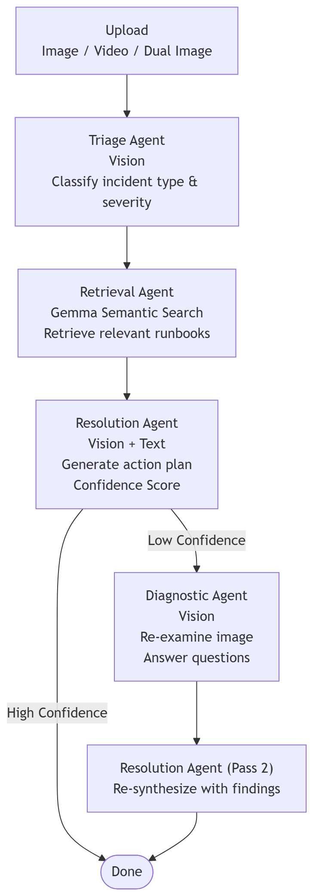

# TriageFlow

**Multimodal multi-agent incident triage on Gemma 4 31B, built in 24 hours.**

Upload a Grafana screenshot, a before/after image pair, or an MP4 video. Four coordinated AI agents classify the incident, pull the right runbooks, produce a ranked action plan, and fire a diagnostic re-examination when confidence is low. The full 4-agent pipeline completes in **~400ms**, powered by the **Cerebras Wafer-Scale Engine**.

Built for the [Cerebras + Google DeepMind Gemma 4 Hackathon](https://cerebras.ai) -- **Track 1 (Multiverse Agents)** and **Track 3 (Enterprise Impact)**.

---

## Demo

[](https://youtu.be/9rWk5kLPA_w)

---

## Why Cerebras

Running the same 4-agent pipeline on GPU (Groq Llama 3.3-70B) vs Cerebras (Gemma 4 31B):

| Provider | Pipeline latency |
|---|---|
| **Cerebras WSE** | ~400 ms |
| GPU (Groq) | ~4,200 ms |

**10.4x faster end-to-end.** The Cerebras speed is what makes the confidence loop practical. Firing a second diagnostic pass costs milliseconds, not seconds. The benchmark runs live in the app alongside every triage.

---

## What Was Built in 24 Hours

### Multimodal 4-agent pipeline



All four agents run on **Gemma 4 31B** via the Cerebras API. Vision agents receive the raw image alongside text context so the model sees exactly what the on-call SRE sees.

### Agent Wire: live inter-agent messaging
Every message passed between agents streams to the UI in real time over SSE. You watch agents hand off context to each other as the pipeline runs.

### Video triage
Upload an MP4 screen recording of a production incident. OpenCV extracts 5 representative frames and the vision agents process the temporal sequence as a multimodal input.

### Confidence loop
The resolution agent scores its own certainty. If it is not confident, it automatically spins up the diagnostic agent to re-examine the image and answer targeted questions, then re-synthesizes a final plan. Zero human intervention needed.

### Custom knowledge base
Add and remove runbooks via the UI. The retrieval agent reasons over them semantically using Gemma, not keyword matching. Persisted in SQLite.

### Live GPU benchmark
Every triage fires a parallel Groq request with the same prompt. When both finish, the UI auto-populates the speed comparison. Real numbers, not synthetic benchmarks.

---

## What I Would Build With More Time

- **Auto-remediation actions.** The pipeline currently produces an action plan for a human to execute. The next step is giving agents tool access (kubectl, AWS SDK, PagerDuty API) so they can execute low-risk remediations automatically and escalate only the high-risk ones.

- **Vector-based runbook retrieval.** The retrieval agent currently reasons over the full KB as text. Embedding runbooks into a vector store would let retrieval scale to thousands of documents without blowing the context window, and would improve precision on large KBs.

- **Evaluation framework.** There is no ground truth scoring yet. A labeled dataset of incidents with known root causes would let me measure classification accuracy, retrieval precision, and confidence loop trigger rate so improvements can actually be quantified.

---

## Features at a Glance

- **Multimodal inputs** -- single image, before/after dual image, or video (5 frames extracted)
- **Gemma semantic retrieval** -- model reasons over runbooks rather than keyword matching
- **Confidence loop** -- auto-triggers diagnostic re-examination when uncertain
- **Agent Wire** -- live SSE stream of inter-agent message passing
- **Speed benchmark** -- GPU comparison runs in parallel with every triage
- **Custom knowledge base** -- add/remove runbooks via UI, persisted in SQLite
- **Triage history** -- full audit log of every run
- **Webhook / Slack integration** -- fires on every triage completion
- **Incident report download** -- `.txt` artifact with action plan and root cause
- **Docker deployment** -- one-command deploy with `docker-compose up`
- **API key auth** -- optional `X-API-Key` middleware
- **Health check** -- `GET /health` with model, DB, and GPU provider status

---

## Quickstart

### Local

```bash
git clone https://github.com/rheanair7/cerebras_hackathon.git
cd cerebras_hackathon

python -m venv venv
venv\Scripts\activate        # Windows
# source venv/bin/activate   # Mac/Linux

pip install -r requirements.txt
pip install opencv-python    # for video support

set CEREBRAS_API_KEY=your_key_here
set GROQ_API_KEY=your_groq_key_here   # optional, enables GPU benchmark

uvicorn backend:app --port 8000
```

Open http://localhost:8000

### Docker

```bash
cp .env.example .env
# fill in CEREBRAS_API_KEY and optionally GROQ_API_KEY

docker-compose up --build
```

Open http://localhost:8000

---

## Environment Variables

| Variable | Required | Description |
|---|---|---|
| `CEREBRAS_API_KEY` | Yes | Cerebras API key, get one at [cerebras.ai](https://cerebras.ai) |
| `GROQ_API_KEY` | No | Enables live GPU benchmark (free at [console.groq.com](https://console.groq.com)) |
| `FIREWORKS_API_KEY` | No | Alternative GPU provider for benchmark |
| `TOGETHER_API_KEY` | No | Alternative GPU provider for benchmark |
| `TRIAGEFLOW_API_KEY` | No | Enables API key auth on `/triage` and `/benchmark` |
| `DATA_DIR` | No | SQLite storage path (defaults to `triageflow_app/`, set to `/app/data` in Docker) |

---

## API

| Method | Endpoint | Description |
|---|---|---|
| `GET` | `/` | UI |
| `POST` | `/triage` | Run pipeline (SSE stream). Fields: `file`, `file2` (optional), `log` (optional), `mode` (incident/support) |
| `POST` | `/benchmark` | Run standalone GPU comparison (SSE stream) |
| `GET` | `/health` | Model, DB, and GPU provider status |
| `GET` | `/history` | Last 20 triage runs |
| `DELETE` | `/history` | Clear audit log |
| `GET` | `/kb` | List custom KB entries |
| `POST` | `/kb` | Add KB entry |
| `DELETE` | `/kb/{key}` | Remove KB entry |
| `GET` | `/settings` | Webhook URL and GPU provider config |
| `POST` | `/settings` | Update webhook URL |
| `GET` | `/demo-scenarios` | List available demo scenarios |

---

## Stack

| Layer | Technology |
|---|---|
| Model | Gemma 4 31B (`gemma-4-31b`) via Cerebras API |
| Backend | FastAPI + Server-Sent Events |
| Storage | SQLite (audit log, custom KB, settings) |
| Video | OpenCV frame extraction |
| GPU benchmark | OpenAI-compatible clients (Groq / Fireworks / Together AI) |
| Frontend | Single-file HTML/CSS/JS, no build step |

---

## Project Structure

```
cerebras_hackathon/
├── backend.py           # FastAPI app, all 4 agents, SSE pipeline
├── index.html           # Single-file UI
├── requirements.txt
├── Dockerfile
├── docker-compose.yml
├── demo_images/         # Test images + system design + demo video
├── .env.example
└── README.md
```
